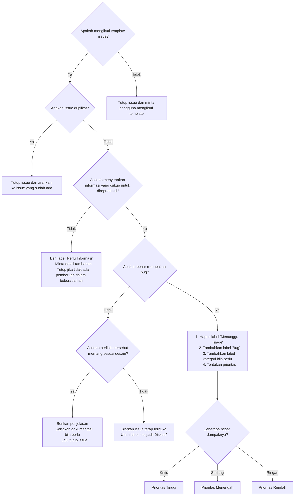

> Edu adalah proyek komunitas - dan karena itu kami menyukai kontribusi dari semua jenis! Sekecil apapun itu ❤️

Ada berbagai cara berbeda yang dapat Anda lakukan untuk berkontribusi pada ekosistem NLFTs.

## Cara Berkontribusi

### Mengatasi Masalah dan Membantu dalam Diskusi

Periksa masalah dan diskusi untuk proyek yang ingin Anda bantu. Misalnya, berikut adalah [papan masalah](https://github.com/nlfts/edu.nlfts.dev/issues) dan [diskusi](https://nlfts.dev/discord) untuk Edu. Membantu pengguna lain, berbagi solusi sementara, membuat reproduksi, atau bahkan sedikit menyelidiki bug dan berbagi temuan Anda akan sangat membantu.

### Membuat Masalah

Terima kasih telah meluangkan waktu untuk membuat masalah! ❤️

- **Melaporkan bug**: Lihat [panduan kami](/docs/lapor-bug) untuk beberapa hal yang perlu dilakukan sebelum membuka issue.

- **Permintaan fitur**: Periksa apakah sudah ada issue atau diskusi yang mencakup ruang lingkup fitur yang Anda inginkan. Jika fitur tersebut terkait dengan bagian lain dari ekosistem NLFTs (seperti package), pertimbangkan untuk mengajukan permintaan fitur di sana terlebih dahulu. Jika fitur yang Anda inginkan bersifat umum atau API-nya tidak sepenuhnya jelas, pertimbangkan untuk membuka diskusi di bagian **Ide** untuk berdiskusi dengan komunitas terlebih dahulu.

Kami akan berusaha sebaik mungkin untuk mengikuti [proses pengambilan keputusan issue internal kami]()  saat menanggapi masalah.

### Kirim Permintaan Pull Request

> Kami selalu menerima permintaan pull request! ❤️

#### Sebelum Anda Mulai

Sebelum Anda memperbaiki bug, kami sarankan Anda memeriksa apakah **ada masalah yang menjelaskan bug tersebut**, karena mungkin itu masalah dokumentasi atau ada konteks yang perlu diketahui.

Jika Anda mengerjakan fitur, kami meminta Anda untuk **membuka masalah permintaan fitur terlebih dahulu** untuk berdiskusi dengan pengelola apakah fitur tersebut diinginkan - dan desain fitur tersebut. Ini membantu menghemat waktu bagi pengelola dan kontributor dan berarti fitur dapat dirilis lebih cepat. Masalah tersebut **harus dikonfirmasi** oleh anggota tim kerangka kerja sebelum membangun fitur dalam permintaan tarik (pull request).

Untuk perbaikan kesalahan ketik, disarankan untuk menggabungkan beberapa perbaikan kesalahan ketik ke dalam satu permintaan tarik untuk menjaga riwayat commit yang lebih bersih.

Untuk perubahan yang lebih besar pada edu itu sendiri, kami sarankan Anda terlebih dahulu membuat modul edu dan mengimplementasikan fitur tersebut di sana. Ini memungkinkan pembuktian konsep yang cepat. Anda kemudian dapat [bergabung dengan tim internal](/docs/kontribusi-untuk-pengembang-internal) dalam bentuk karir. Saat pengguna mengadopsinya dan Anda mengumpulkan umpan balik,

#### Konvensional Commit

Kami menggunakan [Konvensional Commit](https://www.conventionalcommits.org) untuk pesan komitmen terhadap perubahan kode, yang [memungkinkan pembuatan changelog secara otomatis](https://github.com/unjs/changelogen) berdasarkan komitmen. Silakan baca panduan ini jika Anda belum terbiasa dengannya.

Perhatikan bahwa `fix:` dan `feat:` adalah untuk **perubahan kode aktual** (yang mungkin memengaruhi logika). Untuk kesalahan ketik atau perubahan dokumen, gunakan `docs:` atau `chore:` sebagai gantinya:

- ~~fix: typo~~ -> `docs: fix typo`

Jika Anda bekerja dalam proyek dengan monorepo, seperti `nlfts/edu.nlfts/dev`, pastikan Anda menentukan cakupan utama commit Anda dalam tanda kurung. Misalnya: `feat(kit): add 'addMagicStuff' utility`.


#### Membuat Permintaan Tarik

Jika Anda tidak tahu cara mengirim permintaan tarik, kami sarankan membaca [panduan](https://docs.github.com/en/pull-requests/collaborating-with-pull-requests/proposing-changes-to-your-work-with-pull-requests/creating-a-pull-request).

Saat mengirim permintaan tarik, pastikan judul PR Anda juga mengikuti [Konvensi Komit](/docs/4.x/community/contribution#konvensi-komit).

Jika PR Anda memperbaiki atau menyelesaikan masalah yang ada, pastikan Anda menyebutkannya dalam deskripsi PR.

Tidak masalah memiliki beberapa komit dalam satu PR Anda tidak perlu rebase atau force push untuk perubahan Anda karena kami akan menggunakan `Squash and Merge` untuk menggabungkan komit menjadi satu komit saat penggabungan.

Kami tidak menambahkan hook komit apa pun untuk memungkinkan komit cepat. Tetapi sebelum Anda membuat permintaan tarik, Anda harus memastikan bahwa semua skrip lint/test berjalan dengan baik.

Secara umum, pastikan juga tidak ada perubahan yang *tidak terkait* dalam sebuah PR. Misalnya, jika editor Anda telah membuat perubahan pada spasi atau pemformatan di tempat lain dalam file yang Anda edit, harap kembalikan ini agar lebih jelas apa yang diubah oleh PR Anda. Dan harap hindari menyertakan beberapa fitur atau perbaikan yang tidak terkait dalam satu PR. Jika memungkinkan untuk memisahkannya, lebih baik memiliki beberapa PR untuk ditinjau dan digabungkan secara terpisah. Secara umum, sebuah PR harus melakukan *satu hal saja*.

#### Setelah Anda Membuat Permintaan Tarik

Setelah Anda membuat permintaan tarik, kami akan berusaha semaksimal mungkin untuk meninjaunya dengan segera.

Jika kami menetapkannya ke pemelihara, itu berarti orang tersebut akan memberikan perhatian khusus untuk meninjaunya dan menerapkan perubahan apa pun yang mungkin diperlukan.

Jika kami meminta perubahan pada sebuah PR, harap abaikan teks merah! Itu tidak berarti kami menganggap PR itu buruk - itu hanya cara untuk mengetahui status daftar permintaan tarik dengan cepat sekilas.

Jika kami menandai PR sebagai `pending`, itu berarti kami mungkin memiliki tugas lain yang harus dilakukan dalam meninjau PR - ini adalah catatan internal untuk diri sendiri, dan belum tentu mencerminkan apakah PR itu ide bagus atau tidak. Kami akan berusaha semaksimal mungkin untuk menjelaskan melalui komentar alasan status tertunda tersebut.

Kami akan berusaha semaksimal mungkin untuk mengikuti diagram alur pengambilan keputusan PR :



### Kontribusi Berbantuan AI

Kami menyambut penggunaan alat AI secara bijaksana saat berkontribusi ke edu, namun meminta semua kontributor untuk mengikuti [empat prinsip inti](https://davingm.com/id/blog/empat-prinsip-inti-kontribusi-dengan-ai).

#### Jangan pernah biarkan LLM berbicara untuk Anda

- Semua komentar, masalah, dan deskripsi permintaan tarik harus ditulis dengan suara Anda sendiri
- Kami menghargai komunikasi manusia yang jelas daripada tata bahasa atau ejaan yang sempurna
- Hindari menempelkan ringkasan yang dihasilkan AI yang tidak mencerminkan pemahaman Anda sendiri

#### Jangan pernah biarkan LLM berpikir untuk Anda

- Jangan ragu untuk menggunakan alat AI untuk menghasilkan kode atau mengeksplorasi ide
- Hanya kirimkan kontribusi yang Anda pahami sepenuhnya dan dapat Anda jelaskan
- Kontribusi harus mencerminkan penalaran dan pemecahan masalah Anda sendiri

Tujuan kami adalah memastikan kualitas dan mempertahankan kegembiraan berkolaborasi dan berkomunikasi dengan orang sungguhan. Jika Anda memiliki ide untuk meningkatkan kebijakan kami tentang AI di komunitas NLFTs nanti, kami ingin mendengarnya! ❤️

### Konvensi di Seluruh Ekosistem

Konvensi berikut *diwajibkan* dalam organisasi [NLFTs](https://github.com/nlfts) dan direkomendasikan untuk pemelihara lain di ekosistem.

##### Pengaturan IDE

Kami merekomendasikan penggunaan [VS Code](https://code.visualstudio.com) bersama dengan [ekstensi ESLint](https://marketplace.visualstudio.com/items?itemName=dbaeumer.vscode-eslint). Jika Anda mau, Anda dapat mengaktifkan perbaikan otomatis dan pemformatan saat Anda menyimpan kode yang Anda edit:

```json [settings.json]
{
  "editor.codeActionsOnSave": {
    "source.fixAll": "never",
    "source.fixAll.eslint": "explicit"
  }
}
```

#### Tidak Ada Prettier

Karena ESLint sudah dikonfigurasi untuk memformat kode, tidak perlu menduplikasi fungsionalitas dengan Prettier. Untuk memformat kode, Anda dapat menjalankan `yarn lint --fix`, `pnpm lint --fix`, `bun run lint --fix`, atau `deno run lint --fix` atau merujuk ke [bagian ESLint](/docs/4.x/community/contribution#gunakan-eslint) untuk Pengaturan IDE.

Jika Anda memiliki Prettier terinstal di editor, kami sarankan Anda menonaktifkannya saat mengerjakan proyek untuk menghindari konflik. atau anda lebih suka dengan pendekatan biome itu tidak jadi masalah

#### Manajer Paket

Kami merekomendasikan `pnpm` sebagai manajer paket untuk modul, pustaka, dan aplikasi.

Penting untuk mengaktifkan Corepack untuk memastikan Anda menggunakan versi manajer paket yang sama dengan proyek. Corepack sudah terintegrasi ke dalam versi node baru untuk integrasi manajer paket yang mulus.

Untuk mengaktifkannya, jalankan

```bash [Terminal]
corepack enable
```

Anda hanya perlu melakukan ini satu kali, setelah Node.js diinstal di komputer Anda.

## Panduan Gaya Dokumentasi

Dokumentasi adalah bagian penting dari Edu. Kami bertujuan menjadi Platfrom yang Membantu sebagian besar masalah juga memastikan bahwa pengalaman pengembang dan dokumennya sempurna di seluruh ekosistem. 👌

Berikut adalah beberapa tip yang dapat membantu meningkatkan dokumentasi Anda:

### Bahasa

- Gunakan ejaan **Bahasa indonesia asli** (*Kamu* daripada *anda*, *Saya* daripada *Aku*).
- Tulis nama alat dan proyek menggunakan kapitalisasi resminya, bahkan saat nama paket npm menggunakan huruf kecil (misalnya, *PostCSS* daripada *postcss*, *Vite* daripada *vite*, *ESLint* daripada *eslint*). Gunakan nama paket npm huruf kecil di backticks hanya saat merujuk ke paket itu sendiri, seperti dalam petunjuk instalasi.